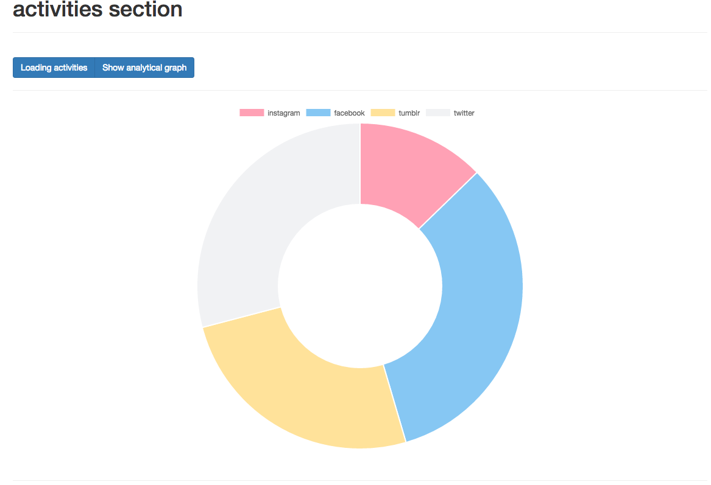

Instructions
---
```shell
sudo npm install npm -g
sudo npm install -g typescript
npm install
PORT=9000 npm start
```

Build production
---
```shell
npm run flow.build:prod
cd demo-build
```
The production version will be inside demo-build directory

Steps
---
- `open localhost:9000` in browser
- click the button "load activities"

Heroku
---
```
web: node server.js
```

[Heroku](https://hidden-hollows-37818.herokuapp.com/)
Note
---
implemented using: 
- [angular2](https://angular.io/)
- [ng2-bootstrap](http://valor-software.com/ng2-bootstrap/)
- [ng2-charts](http://valor-software.com/ng2-charts/)


Chart
---
```html
    <base-chart class="chart" *ngIf="graphVisible"
               [data]="chartData"
               [labels]="chartLabels"
               [chartType]="chartType">
    </base-chart>
```

